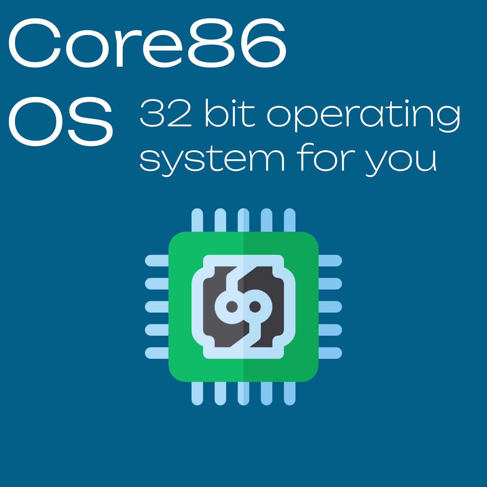

<p align="center">
	
</p>

<p align="center">Core86 - 32-bit operating system in assembly language and C</p>
<br>
<p align="center">
    
    
    
    
    
    </br>
</p>

> A new step, a new future

Core86 - 32-bit operating system in assembly language and C

> [!CAUTION]
> At the moment, Core86 OS is under active development, many things may not work, and this version is not recommended for use (all at your own risk).

## Contact and support
If you have questions about using Core86 OS, then create an [issue](https://github.com/alexeev-engineer/core86-os/issues/new) in the repository or write to me at bro.alexeev@inbox.ru.

You can also write to me on Telegram: [@alexeev_dev](https://t.me/alexeev_dev)

Core86 OS is an Open Source project, and it only survives due to your feedback and support!

Project releases are available at [this link](https://github.com/alexeev-engineer/core86-os/releases).

## Requirements
To build and run Core86 OS you will need to install some dependencies and requirements:

 + QEMU - open source virtual machine emulator
 + base-devel/build-essential - packages for building
 + NASM - open source assembler
 + GCC - gnu compiler collection, C compiler
 + make - build system
 + wget - for download some packages

To install these packages on Arch Linux, run this command:

```bash
sudo pacman -Sy nasm qemu-full base-devel make gcc wget
```

## Building
To compile Core86 OS, run `make build clean` in your terminal.

To run Core86 OS, run `make run` in your terminal.

## Functional
Here you can see what Core86-OS can already do and what else is planned to be added in the future:

 - [x] Transition from 16-bit real address mode to protected 32-bit mode
 - [ ] Create kernel in C language
 - [ ] Create screen driver
 - [ ] Create shell
 - [ ] Create keyboard driver
 - [ ] Create file system

## Copyright
Copyright © 2024, Alexeev Bronislav and Core86® LLC

All rights reversed
